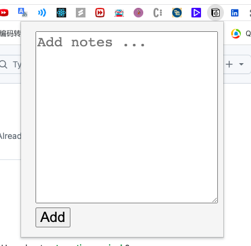

# leetcode2notion-extended

This is a extended version of the Chrome extension [leetcode2notion](https://github.com/roundhd/leetcode2notion) originally developed by [roundhd](https://github.com/roundhd). The updated version introduces new features for an improved user experience.

## 🌟 New Features

1. **Enhanced Problem Information Extraction**: Unlike the original version, which could only extract the problem name from the description page, this revised version allows extraction from various parts of the Leetcode website.
2. **Improved Note Input Box**: The note input box has been redesigned to be larger and easier to view.

## Prerequisite

The prerequisite remains the same as the original version. Create a database in Notion with at least the fields `Name`, `Link`, `Date`, `Difficulty`, and `Notes`.

## Getting Started

Follow the original "Getting Started" section for the initial setup and use the original instructions for loading the extension as detailed in the original README.

## Extending the Project

If you'd like to add more input boxes similar to the "Notes" improvement made in this revision, you can do so easily in React:

1. Navigate to the component where the input box is defined.
2. Copy the existing JSX code for the input box.
3. Modify the `name`, `id`, or any other attributes to suit the new input.
4. Make sure to update the state and event handlers accordingly.

## Credits

All credits for the original codebase go to [roundhd](https://github.com/roundhd). This revised version introduces improvements to specific functionalities of the extension.
